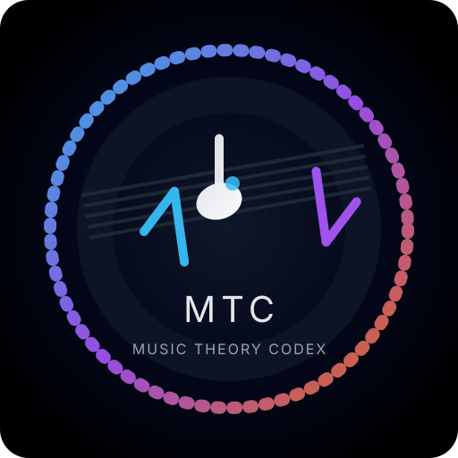

# Open Source Music Theory Codex

> A **docs-as-code** playground for harmonic archeology — from Ragtime and Bebop to City Pop, Future Funk, and modern EDM.

<p align="center">
  <a href="https://github.com/yourusername/music-theory-codex/actions">
    
  </a>
  
  
  
  
  
  
</p>

<p align="center">
  
</p>

---

## 📚 Overview

The **Open Source Music Theory Codex** is a comprehensive, interactive repository for exploring music theory as if it were source code. It traces the harmonic lineage of **70+ genres**, from the syncopated roots of **Ragtime** and **Jazz**, through the **Funk** and **AOR** era, to the sophisticated urban soundscapes of **City Pop**, **Shibuya-kei**, **Future Funk**, and **K-Pop**.

Use it as:

- A **theory lab** for chord progressions and voicings.
- A **genre map** for harmonic evolution.
- A **reference codex** you can version, diff, and extend like any other codebase.

---

## 🧭 Table of Contents

- [Features](#-features)
- [Tech Stack](#-tech-stack)
- [Getting Started](#-getting-started)
- [Docker Deployment](#-docker-deployment)
- [Project Structure](#-project-structure)
- [Development Scripts](#-development-scripts)
- [Using the App](#-using-the-app)
- [MIDI Export Workflow](#-midi-export-workflow)
- [Data Model](#-data-model)
- [Design Notes](#-design-notes)
- [Testing & Quality](#-testing--quality)
- [Roadmap](#-roadmap)
- [Contributing](#-contributing)
- [Troubleshooting & FAQ](#-troubleshooting--faq)
- [Theory Credits](#-theory-credits)
- [License](#-license)

---

## 🎵 Features

- **Genre Codex:** Detailed harmonic breakdown of **70+ genres** across 5 historical phases:

  - Phase I: Jazz Foundations (1910s–50s)
  - Phase II: Rhythm Evolution (50s–70s)
  - Phase III: Fusion & Sophistication (70s–80s)
  - Phase IV: The Japanese Evolution (70s–90s)
  - Phase V: Modern Derivatives (90s–Present)

- **Instrument Visualizer Engine:** Dynamic rendering of chord voicings for:
  - 🎹 **Piano:** Highlighted key voicings (Rootless, Shells, Clusters, *So What*).
  - 🎸 **Guitar:** Fretboard diagrams for specific grips (Hendrix thumb-over, Nile Rodgers-style strum patterns).
  - 🎻 **Ukulele:** Jazz and Funk voicing charts with re-entrant tuning logic.

- **Interactive Circle of Fifths:** An SVG-based tool to visualize:
  - Key signatures
  - Relative majors/minors
  - Modal borrowing and pivot keys

- **Audio Reference Lab:**
  - One-click generation of curated YouTube search queries for immediate listening examples.
  - Genre + decade + harmonic concept = pre-baked search string.

- **MIDI Export (beta):**
  - Render any visible progression in the Instrument Visualizer into a downloadable `.mid` file.
  - Uses the chord shapes already on screen so your DAW session matches the harmonic intent shown in the UI.

- **Responsive UI:**
  - Modern Git documentation aesthetic (MkDocs/GitBook vibes).
  - Dark-mode friendly, mobile-friendly, and readable enough to stare at for hours while overthinking a ii–V–I.

---

## 🛠️ Tech Stack

- **Core:** React 18, TypeScript
- **Build Tool:** Vite
- **Styling:** Tailwind CSS
- **Icons:** Lucide React
- **Deployment:** Docker (multi-stage Nginx build)
- **Docs-as-Code:** Markdown + JSON/TS data models

### Versions at a glance

| Dependency | Version |
| --- | --- |
| React | 18.x |
| TypeScript | 5.x |
| Vite | 5.x |
| Tailwind CSS | 3.x |
| lucide-react | 0.554.x |

---

## 🚀 Getting Started

### Prerequisites

- Node.js **v18+**
- `npm` or `yarn`

### Local Development

1. **Clone the repository**

   ```bash
   git clone https://github.com/yourusername/music-theory-codex.git
   cd music-theory-codex
   ```

2. **Install dependencies**

   ```bash
   npm install
   # or
   yarn
   ```

3. **Start the development server**

  ```bash
  npm run dev
  # or
  yarn dev
  ```

   Open [http://localhost:5173](http://localhost:5173) in your browser.

### Production build

```bash
npm run build
npm run preview   # Serves the built assets locally
```

`npm run build` runs TypeScript checks and bundles via Vite. Use `npm run preview` for a quick smoke test of the generated assets.

---

## 🐳 Docker Deployment

A multi-stage Dockerfile builds the Vite app with Node 20 and serves it from Nginx. A `.dockerignore` keeps the build context lean and the Nginx config lives in `docker/nginx.conf`.

1. **Build the image**

   ```bash
   docker build -t music-codex .
   ```

2. **Run the container**

   ```bash
   docker run --rm -p 8080:80 --name music-codex music-codex
   ```

3. **Access the app**

   Navigate to [http://localhost:8080](http://localhost:8080). Check `docker logs music-codex` if you need to confirm the container healthcheck is passing.

---

## 📂 Project Structure

```text
music-theory-codex/
├── src/
│   ├── App.tsx                # Main application shell
│   ├── CircleOfFifthsTool.tsx # Circle of Fifths component
│   ├── InstrumentVisualizer.tsx # Instrument rendering logic
│   ├── data/
│   │   ├── chords.ts          # Chord shape data for each instrument
│   │   └── phases.ts          # Genre phases and progression data (70+ genres)
│   ├── types/
│   │   └── codex.ts           # Shared domain types
│   ├── index.css              # Tailwind global styles
│   └── main.tsx               # React entry point
├── docker/
│   └── nginx.conf             # SPA configuration for Nginx
├── Dockerfile                 # Multi-stage build configuration
├── .dockerignore              # Build context exclusions
├── index.html                 # Vite HTML template
├── logo.svg                   # Project mark used in the UI
├── package-lock.json          # Locked dependency tree
├── package.json               # Dependencies and scripts
├── postcss.config.js          # Tailwind/PostCSS setup
├── tailwind.config.js         # Tailwind theme configuration
├── tsconfig.json              # TypeScript configuration
├── tsconfig.node.json         # TS config for tooling
├── vite.config.js             # Vite bundler configuration
└── README.md                  # Project documentation
```

---

## 📜 Development Scripts

Common scripts (check `package.json` for the full list):

```bash
# Run dev server
npm run dev

# Production build
npm run build

# Preview production build
npm run preview
```

---

## 🧪 Using the App

### Explore harmonic phases

1. Open the **Genre Codex** and pick a phase to filter down to an era (e.g., *Phase IV: The Japanese Evolution*).
2. Select a **genre** within that phase to load its characteristic progressions.
3. Switch **decades** to see how voicing preferences shift over time.

### Pivot by instrument

1. In the **Instrument Visualizer**, choose **Piano**, **Guitar**, or **Ukulele**.
2. Hover the rendered shapes to read micro-copy about why a grip is chosen (e.g., voice-leading rationale, string-set choices).
3. Use the genre dropdown to jump between idioms without losing your instrument context.

### Circle of Fifths workflows

1. Click any key to reveal the scale degrees, relative minor, and modal options.
2. Pair the selected key with a genre to get *genre-aware* progressions and chord qualities.
3. Trigger the YouTube search shortcut to immediately audition songs that match the progression/genre combination.

### Authoring new theory entries

1. Add a new genre or progression to `src/data/phases.ts` using the existing shape (`phase`, `genre`, `signatureProgression`).
2. If you need new chord shapes, extend `src/data/chords.ts` with voicings for each instrument, keeping note order and fingering metadata intact.
3. Update `src/types/codex.ts` if you introduce new properties so the UI remains fully typed.

---

## 🎛️ MIDI Export Workflow

The **Export MIDI** button in the Instrument Visualizer turns whatever progression is on screen into a DAW-ready file without leaving the browser.

- **Where it lives:** In the Instrument Visualizer toolbar next to the step navigation controls.
- **What it exports:** The active progression, including any auto-derived chords when a genre lacks explicit `progressionChords` metadata.
- **How it builds notes:**
  - Root detection parses the chord symbol (e.g., `Cmaj7`, `Abm9`) and maps it to MIDI note numbers.
  - Intervals for each chord come from the same `CHORD_SHAPES` data used to draw the voicings, so the exported MIDI matches the on-screen shapes.
  - A 120 BPM, 480 ticks-per-quarter template keeps timing predictable while remaining easy to stretch inside a DAW.
- **File details:** Creates a single-track `.mid` file with note-on/note-off events per chord, using consistent velocity defaults for quick sketching.
- **Workflow tips:**
  - Drop the file into your DAW, quantize or humanize as needed, then swap the instrument patch to taste.
  - Use the keyboard hotkeys (`A`–`G` layout) to audition alternate steps before exporting, keeping the performance loop tight.

Future iterations will layer in per-step durations, swing/humanization controls, and multi-track exports for split voicings (bass + comping).

---

## 🧱 Data Model

- **Phases (`src/data/phases.ts`)** — structured by historical era; each phase holds genres, progressions, and citations for reference listening.
- **Chord shapes (`src/data/chords.ts`)** — normalized definitions for every instrument the visualizer supports. Entries include fingering, intervals, and display hints.
- **Types (`src/types/codex.ts`)** — canonical interfaces for phases, genres, chord shapes, and progressions. Treat this file as the schema contract for all data additions.

Keeping data in TypeScript makes it diff-friendly, reviewable, and easy to validate during builds.

---

## 🧭 Design Notes

- **Docs-as-code first:** Everything lives in version control so theory edits can be reviewed like code.
- **Instrument-forward UI:** The layout favors fretboard/keybed visuals over dense prose, with copy that explains *why* a voicing works.
- **Performance:** Vite + React Suspense keep the experience snappy even when loading many chords.
- **Accessibility:** Semantic HTML, focus states, and descriptive labels aim to keep the codex usable with keyboards and screen readers.
- **Portability:** The Docker image bakes the static assets into Nginx, so any registry/runtime combo can host it.

---

## ✅ Testing & Quality

- **Type + build:** `npm run build` (uses Vite and TypeScript; fails on type errors).
- **Preview bundle:** `npm run preview` to sanity-check routing and static assets locally.
- **Linting:** If you introduce ESLint/Prettier, keep configs co-located in the repo and wire scripts through `package.json`.
- **Manual UX pass:**
  - Verify keyboard tab order for the Circle of Fifths and instrument controls.
  - Resize to mobile widths to confirm the doc-like layout remains readable.
  - Trigger YouTube search links in a fresh tab to ensure strings are encoded correctly.

Document any new test commands you add so contributors know how to reproduce your checks.

---

## 🩹 Troubleshooting & FAQ

- **Port already in use?** Set `PORT=3001` (or any free port) before running `npm run dev`.
- **Fonts or icons missing?** Run `npm install` after pulling; Vite caches can be cleared with `rm -rf node_modules/.vite` if needed.
- **Docker build feels slow?** The multi-stage image uses dependency caching; ensure `package-lock.json` is unchanged to leverage layers.
- **Data shape errors?** Cross-check against `src/types/codex.ts`; TypeScript errors usually point to the exact field that needs updating.

If you hit an issue not listed here, open a GitHub issue with your OS, Node version, and repro steps.

---

### Circle of Fifths Lab

An interactive Circle of Fifths view designed for writers, not just theory nerds.

- Click any key on the **wheel** (or the key pills under it) to select a tonal center.
- See its **major scale**, **relative minor**, and full **diatonic chord family** (I–ii–iii–IV–V–vi–vii°).
- Get **common progressions** (ii–V–I, I–vi–IV–V, Royal Road-style changes, etc.).
- Per-key **instrument tips** for piano, guitar, and ukulele so you can immediately translate the theory into voicings and patterns.

---

### Instrument Visualizer

An instrument-first view of the chord data powering each genre.

- Pick **piano**, **guitar**, or **ukulele** to see voicing fingerprints for each chord in the selected progression.
- Toggle through genres/phases and watch the voicing set update in real time.
- Cross-reference the Circle of Fifths lab to hear/see how a key center affects the grips you choose.

---

## 🧱 Roadmap (Rough, Like a First Mix)

* [ ] Add saved **“progression presets”** per genre (I–vi–IV–V, Royal Road, Rhythm Changes, etc.).
  - Pair presets with genre/decade filters so the codex can surface common reharmonization moves by era.
  - Save/load user-crafted variants to keep personal voicing choices in version control.
* [ ] Add **MIDI export** of generated voicings/progressions.
  - Surface tempo selector, swing/humanize toggles, and per-step duration controls.
  - Add track splitting so bass notes, comping voicings, and melody guide tones land on separate channels.
  - Expose download options from the Circle of Fifths lab to capture key-specific reharmonizations.
* [ ] Add **keyboard overlay** for real-time highlighting from computer keyboard input.
  - Overlay tooltips that explain which hotkey maps to which scale degree per active key.
  - Optional “practice mode” that lights up the next degree in the flow for ear training.
* [ ] Add **“Explain This Progression”** mode (annotated theory breakdown).
  - Inline callouts that reference the genre’s hallmark voice-leading moves.
  - Export the explanation alongside the MIDI as embedded lyrics/marker text for DAW users.
* [ ] Add **offline mode** via service worker + local cache.
  - Cache chord shape sprites and genre data to keep the codex browsable on the road.

If you’re reading this and thinking “I could totally add one of these” — you’re correct, now you have homework.

---

## 🤝 Contributing

1. Fork the repo
2. Create a feature branch:

   ```bash
   git checkout -b feature/my-awesome-thing
   ```
3. Commit your changes with actual messages, not “fix stuff”:

   ```bash
   git commit -m "Add XYZ progression visualizer"
   ```
4. Push and open a Pull Request

Guidelines:

* Keep the code **typed** (TypeScript, not vibescript).
* Keep UI **accessible** (labels, contrast, keyboard navigation).
* Run `npm run build` before you push so CI stays green.
* If you add a new genre or concept, document it in the Codex and keep data consistent with `src/types/codex.ts`.

---

## 🎼 Theory Credits

Data compiled from the **Open Source Music Theory Codex** report, analyzing:

* **The Royal Road (*Ōdō Shinkō*)** progression in City Pop.
* **Tritone Substitutions** in Bebop.
* **The “One”** in Deep Funk.
* **Quartal Harmony** in Modal Jazz and Neo-Soul.

And a whole lot of unnecessary time spent pausing songs on the exact right chord.

---

## 📄 License

This project is released under the **Creative Commons CC0 1.0 Universal** license.

You can copy, modify, distribute, and use the work — even for commercial purposes — without asking permission.

For details, see:
**[CC0 1.0 Universal Legal Code](https://creativecommons.org/publicdomain/zero/1.0/legalcode)**
